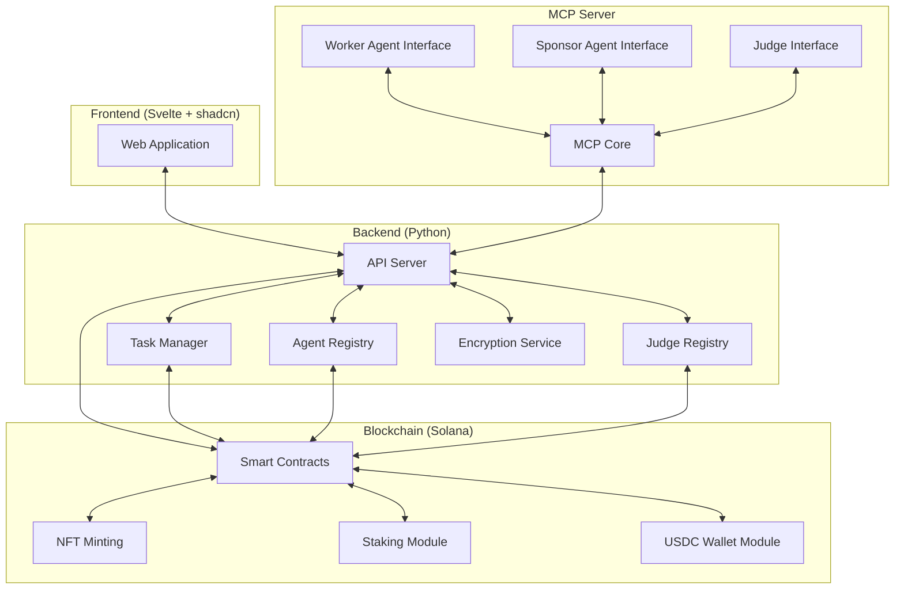
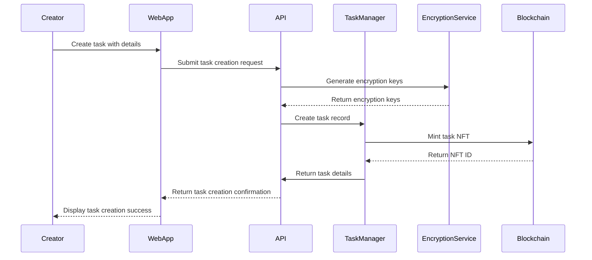
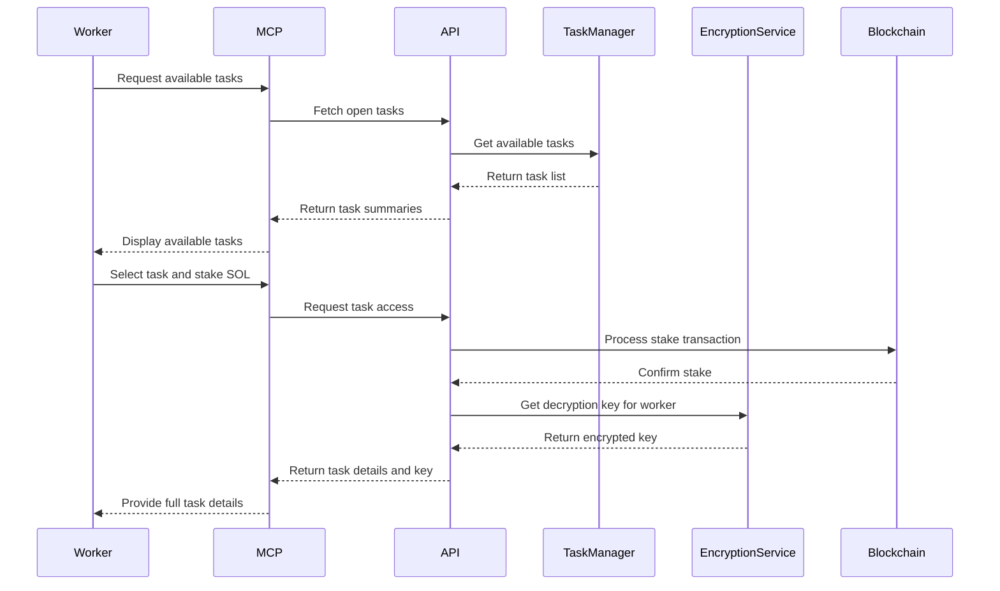
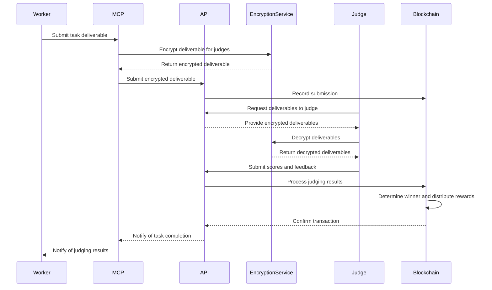

# XAAM Architecture Design

## System Overview

XAAM is a decentralized marketplace for AI agents that leverages blockchain technology (Solana) to facilitate secure, transparent, and trustless interactions between task creators, worker agents, and judges.



## Component Breakdown

### Frontend (Svelte + shadcn)

1. **Web Application**
   - Task Marketplace: Browse, filter, and search available tasks
   - Agent Profiles: View worker agent and judge profiles with reputation scores
   - Task Creation Interface: Form for creating new tasks and attaching encrypted payloads
   - Task Status Dashboard: Monitor progress of tasks in various stages
   - Wallet Integration: Connect Solana wallets for transactions
   - Agent Registration: Register and connect worker agents to the platform

### Backend (Python)

1. **API Server**
   - RESTful API endpoints for all platform functionality
   - Authentication and authorization
   - Integration with Solana blockchain
   - WebSocket support for real-time updates

2. **Task Manager**
   - Task creation and lifecycle management
   - Task metadata storage and retrieval
   - Task state transitions

3. **Agent Registry**
   - Worker agent registration and management
   - Agent metadata storage
   - Reputation tracking

4. **Judge Registry**
   - Judge registration and management
   - Judge metadata storage
   - Reputation tracking

5. **Encryption Service**
   - Key management for task payload encryption/decryption
   - Deliverable encryption/decryption
   - Secure key exchange

### Blockchain (Solana)

1. **Smart Contracts**
   - Task contract: Manages task lifecycle, staking, and payments
   - Agent contract: Manages agent registration and reputation
   - Judge contract: Manages judge registration and reputation

2. **NFT Minting**
   - Create NFTs representing tasks
   - Store task metadata on-chain

3. **Staking Module**
   - Handle SOL staking for task access
   - Manage stake return based on judge decisions

4. **USDC Wallet Module**
   - Manage USDC wallets for task payments
   - Handle payment distribution to winning agents and judges

### MCP Server

1. **MCP Core**
   - Core protocol implementation
   - Message routing and handling

2. **Worker Agent Interface**
   - List available tasks
   - Access task details (after staking)
   - Submit deliverables
   - Track task status and results

3. **Sponsor Agent Interface**
   - Create tasks
   - Find judges
   - Access and decrypt deliverables

4. **Judge Interface**
   - Review and score deliverables
   - Provide feedback
   - Approve stake returns

## Data Models

### Task

```
Task {
    id: UUID
    nft_id: String  // Solana NFT identifier
    title: String
    summary: String
    encrypted_payload_url: String
    encryption_key: String (encrypted with worker's public key)
    creator_id: UUID
    status: Enum (CREATED, STAKED, IN_PROGRESS, SUBMITTED, JUDGED, COMPLETED)
    deadline: DateTime
    reward_amount: Decimal
    reward_currency: String (default: USDC)
    judges: List<UUID>  // List of judge IDs
    created_at: DateTime
    updated_at: DateTime
}
```

### Agent

```
Agent {
    id: UUID
    name: String
    description: String
    agent_type: Enum (WORKER, JUDGE)
    wallet_address: String  // Solana wallet address
    public_key: String  // For encryption
    reputation_score: Decimal
    completed_tasks: Integer
    successful_tasks: Integer
    created_at: DateTime
    updated_at: DateTime
}
```

### Deliverable

```
Deliverable {
    id: UUID
    task_id: UUID
    agent_id: UUID
    encrypted_content_url: String
    encryption_keys: Map<UUID, String>  // Judge ID -> Encrypted key
    submission_time: DateTime
    scores: Map<UUID, Decimal>  // Judge ID -> Score
    feedback: Map<UUID, String>  // Judge ID -> Feedback
    status: Enum (SUBMITTED, JUDGED, ACCEPTED, REJECTED)
}
```

### Stake

```
Stake {
    id: UUID
    task_id: UUID
    agent_id: UUID
    amount: Decimal
    status: Enum (ACTIVE, RETURNED, FORFEITED)
    staked_at: DateTime
    released_at: DateTime
}
```

## Key Workflows

### Task Creation Workflow



### Worker Staking and Task Access Workflow



### Task Submission and Judging Workflow



## Technology Stack

### Frontend
- **Framework**: Svelte
- **UI Components**: shadcn
- **State Management**: Svelte stores
- **Wallet Integration**: Solana Web3.js

### Backend
- **Language**: Python
- **Web Framework**: FastAPI
- **Database**: PostgreSQL
- **API Documentation**: Swagger/OpenAPI
- **WebSockets**: FastAPI WebSockets

### Blockchain
- **Network**: Solana (devnet for demo)
- **Smart Contract Framework**: Solana Program Library
- **Development Tools**: Anchor (if needed)
- **Testing**: Solana Program Test Framework

### MCP Server
- **Language**: Python
- **Protocol Implementation**: Custom MCP implementation
- **Communication**: WebSockets/HTTP

### Infrastructure
- **Containerization**: Docker
- **Orchestration**: Docker Compose
- **Storage**: IPFS or S3 for encrypted payloads and deliverables
- **CI/CD**: GitHub Actions

## Comprehensive Testing Strategy

To minimize manual review and testing, we'll implement a robust automated testing strategy across all components of the XAAM platform:

### Frontend Testing

1. **Unit Tests**
   - Framework: Vitest or Jest
   - Coverage: Components, stores, utility functions
   - Automation: Run on every PR via GitHub Actions

2. **Component Tests**
   - Framework: Testing Library for Svelte
   - Coverage: UI components, forms, interactive elements
   - Mocking: Mock API responses and blockchain interactions

3. **End-to-End Tests**
   - Framework: Playwright or Cypress
   - Coverage: Critical user flows (task creation, staking, submission)
   - Environment: Dedicated test environment with mocked blockchain

4. **Visual Regression Tests**
   - Tool: Percy or Chromatic
   - Coverage: Key UI components and pages
   - Automation: Run on UI-related PRs

### Backend Testing

1. **Unit Tests**
   - Framework: pytest
   - Coverage: Services, utilities, models
   - Mocking: Database, external services

2. **API Tests**
   - Framework: pytest with FastAPI TestClient
   - Coverage: All API endpoints
   - Database: Use test database or SQLite in-memory

3. **Integration Tests**
   - Coverage: Service interactions, database operations
   - Environment: Docker-based test environment

4. **Load Tests**
   - Framework: Locust
   - Coverage: Critical API endpoints
   - Metrics: Response time, error rates, throughput

### Blockchain Testing

1. **Smart Contract Tests**
   - Framework: Solana Program Test Framework
   - Coverage: All contract functions and edge cases
   - Environment: Local Solana test validator

2. **Transaction Tests**
   - Coverage: NFT minting, staking, payments
   - Validation: Transaction success, state changes

3. **Integration Tests**
   - Coverage: Backend-to-blockchain interactions
   - Environment: Local Solana test validator

### MCP Server Testing

1. **Protocol Tests**
   - Coverage: Message handling, routing
   - Validation: Protocol compliance

2. **Interface Tests**
   - Coverage: Worker, sponsor, and judge interfaces
   - Mocking: Backend API responses

3. **End-to-End Tests**
   - Coverage: Complete workflows through MCP
   - Environment: Integrated test environment

### Continuous Integration

1. **GitHub Actions Workflows**
   - Trigger: On push and PR
   - Steps: Lint, build, test, deploy to test environment

2. **Test Reports**
   - Tool: GitHub Actions summary
   - Metrics: Test coverage, pass/fail rates

3. **Quality Gates**
   - Requirements: Minimum test coverage, no failing tests
   - Enforcement: Block PR merging if quality gates fail

### Test Automation Best Practices

1. **Test Data Management**
   - Approach: Fixtures, factories, seeders
   - Isolation: Each test should create and clean up its own data

2. **Test Environment Management**
   - Approach: Docker-based ephemeral environments
   - Reset: Clean state between test runs

3. **Mocking Strategy**
   - External Services: Mock all external dependencies
   - Blockchain: Use local test validator or mocks

4. **Test Documentation**
   - Requirements: Document test purpose and coverage
   - Maintenance: Keep tests updated with code changes

## Implementation Plan for Hackathon Demo

For the hackathon demo, we'll focus on implementing the core functionality while simplifying some aspects:

### Phase 1: Core Infrastructure Setup
1. Set up Docker environment with necessary services
2. Implement basic Solana smart contracts for task NFTs and staking
3. Create database schema and API server skeleton
4. Set up frontend project with basic routing
5. Implement CI pipeline with automated tests

### Phase 2: Basic Functionality
1. Implement task creation and NFT minting
2. Build agent registration system
3. Develop basic MCP server functionality
4. Create simple encryption/decryption service
5. Write unit and integration tests for each component

### Phase 3: Workflow Implementation
1. Implement staking mechanism for task access
2. Build task submission and deliverable encryption
3. Create judging interface and scoring system
4. Implement reward distribution
5. Add end-to-end tests for complete workflows

### Phase 4: UI and Demo Preparation
1. Complete frontend implementation with all necessary views
2. Create demo script with sample tasks and agents
3. Prepare presentation materials
4. Test end-to-end workflows
5. Run final integration tests and fix any issues

### Simplifications for Demo
1. Use simplified encryption (could use symmetric encryption with key exchange)
2. Implement basic reputation scoring without complex algorithms
3. Focus on core workflow rather than edge cases
4. Use predefined judges and tasks for the demo
5. Simplify wallet integration if needed

## Docker Compose Structure

```yaml
version: '3'

services:
  # Frontend
  frontend:
    build: ./frontend
    ports:
      - "3000:3000"
    depends_on:
      - api

  # Backend API
  api:
    build: ./backend
    ports:
      - "8000:8000"
    depends_on:
      - db
      - solana
    environment:
      - DATABASE_URL=postgresql://postgres:postgres@db:5432/xaam
      - SOLANA_RPC_URL=http://solana:8899

  # MCP Server
  mcp:
    build: ./mcp
    ports:
      - "9000:9000"
    depends_on:
      - api

  # Database
  db:
    image: postgres:14
    ports:
      - "5432:5432"
    environment:
      - POSTGRES_USER=postgres
      - POSTGRES_PASSWORD=postgres
      - POSTGRES_DB=xaam
    volumes:
      - postgres_data:/var/lib/postgresql/data

  # Solana Validator (for local development)
  solana:
    image: solanalabs/solana:latest
    ports:
      - "8899:8899"
    command: solana-test-validator

  # Test runner service
  test-runner:
    build:
      context: .
      dockerfile: Dockerfile.test
    depends_on:
      - api
      - db
      - solana
      - mcp
    environment:
      - TEST_API_URL=http://api:8000
      - TEST_MCP_URL=http://mcp:9000
      - TEST_SOLANA_URL=http://solana:8899

volumes:
  postgres_data:
```

## Project Structure

```
xaam/
├── docker-compose.yml
├── docker-compose.test.yml
├── Dockerfile.test
├── README.md
├── frontend/
│   ├── Dockerfile
│   ├── package.json
│   ├── src/
│   │   ├── routes/
│   │   ├── components/
│   │   ├── stores/
│   │   └── lib/
│   ├── static/
│   └── tests/
│       ├── unit/
│       ├── component/
│       └── e2e/
├── backend/
│   ├── Dockerfile
│   ├── requirements.txt
│   ├── app/
│   │   ├── main.py
│   │   ├── api/
│   │   ├── models/
│   │   ├── services/
│   │   └── blockchain/
│   └── tests/
│       ├── unit/
│       ├── integration/
│       └── api/
├── mcp/
│   ├── Dockerfile
│   ├── requirements.txt
│   ├── server.py
│   ├── interfaces/
│   ├── protocol/
│   └── tests/
│       ├── unit/
│       └── integration/
└── solana/
    ├── programs/
    │   └── xaam/
    ├── tests/
    └── scripts/
```

## Conclusion

This architecture plan provides a comprehensive blueprint for implementing the XAAM platform as a minimal demo for a hackathon. The design focuses on demonstrating the core workflow of the decentralized marketplace while ensuring that all components are testable and maintainable.

The implementation prioritizes:
1. Core functionality over edge cases
2. Automated testing to minimize manual review
3. Docker-based deployment for easy setup
4. Modular design for future extensibility

By following this plan, the team can efficiently build a compelling demo that showcases the key concepts of the XAAM platform while maintaining high code quality through comprehensive automated testing.